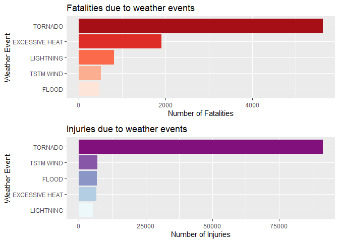
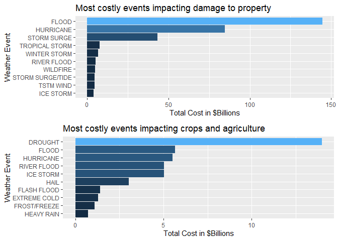

# Health & Economic Impact of US Weather events  
## Introduction

Storms and other severe weather events can cause both public health and economic problems for communities and municipalities. Many severe events can result in fatalities, injuries, and property damage, and preventing such outcomes to the extent possible is a key concern.

The following document describes an analysis of the US National Oceanic and Atmospheric Administration’s (NOAA) storm database and in particular will answer two questions: which types of weather events are most harmful to population health, and which types of weather events have the most costly economic impact. 

This database tracks characteristics of major storms and weather events in the United States, including when and where they occur, as well as estimates of any fatalities, injuries, and property damage. The database itself has various inaccuracies and data issues but this analysis will describe the steps taken to try and clean the dataset. 

## Data 

The data for this assignment come in the form of a comma-separated-value file compressed via the bzip2 algorithm to reduce its size. You can download the file from the course web site:

[Storm Data](https://d396qusza40orc.cloudfront.net/repdata%2Fdata%2FStormData.csv.bz2) [47Mb]

There is also some documentation of the database available. Here you will find how some of the variables are constructed/defined.

* National Weather Service Storm Data [Documentation](https://d396qusza40orc.cloudfront.net/repdata%2Fpeer2_doc%2Fpd01016005curr.pdf)
* National Climatic Data Center Storm Events [FAQ](https://d396qusza40orc.cloudfront.net/repdata%2Fpeer2_doc%2FNCDC%20Storm%20Events-FAQ%20Page.pdf)

The events in the database start in the year 1950 and end in November 2011. In the earlier years of the database there are generally fewer events recorded, most likely due to a lack of good records. More recent years should be considered more complete.


## Data Processing

We'll make use of the dplyr package, which provides a set of tools for quick and powerful manipulation of tabular datasets. 


```r
library(dplyr)
```

First, we can read the data (which as mentioned previously is stored in compressed format), by using `read.csv()` as normal


```r
dat <- read.csv("repdata_data_StormData.csv.bz2")

dim(dat)
```

```
## [1] 902297     37
```


We can see that the dataset contains 902297 observations of 37 variables. We won't be using all of these variables, so we'll disregard some later. 


Next, let's explore what types of event are categorised in EVTYPE variable.


```r
length(unique(dat[,'EVTYPE']))
```

```
## [1] 985
```

```r
head(unique(dat[,'EVTYPE']),15)
```

```
##  [1] TORNADO                   TSTM WIND                
##  [3] HAIL                      FREEZING RAIN            
##  [5] SNOW                      ICE STORM/FLASH FLOOD    
##  [7] SNOW/ICE                  WINTER STORM             
##  [9] HURRICANE OPAL/HIGH WINDS THUNDERSTORM WINDS       
## [11] RECORD COLD               HURRICANE ERIN           
## [13] HURRICANE OPAL            HEAVY RAIN               
## [15] LIGHTNING                
## 985 Levels:    HIGH SURF ADVISORY  COASTAL FLOOD  FLASH FLOOD ... WND
```

So in total there are 985 unique events, but as we can see from the output of the first 15, some are duplicated and it appears similar events are recorded in different ways.

Take hurricanes, for example:


```r
unique(dat[grep('HURRICANE', dat$EVTYPE),'EVTYPE'])
```

```
## [1] HURRICANE OPAL/HIGH WINDS  HURRICANE ERIN            
## [3] HURRICANE OPAL             HURRICANE                 
## [5] HURRICANE-GENERATED SWELLS HURRICANE EMILY           
## [7] HURRICANE GORDON           HURRICANE FELIX           
## [9] HURRICANE/TYPHOON         
## 985 Levels:    HIGH SURF ADVISORY  COASTAL FLOOD  FLASH FLOOD ... WND
```


Notice that hurricane events appear to be recorded as specific instances of storms, like Gordon, Emily, Opal. Ideally we need to consolidate these into a single 'type' of weather event for further analysis.


```r
dat[grep('HURRICANE', dat$EVTYPE),'EVTYPE'] <- "HURRICANE"

# Confirm we now have a single event type for hurricanes
unique(dat[grep('HURRICANE', dat$EVTYPE),'EVTYPE'])
```

```
## [1] HURRICANE
## 985 Levels:    HIGH SURF ADVISORY  COASTAL FLOOD  FLASH FLOOD ... WND
```

Next, if we look at the values for economic damage, the multiplier is stored in a distinct variable as a character representing the order of magnitude: H = 100, K = 1000 etc. 


```r
head(dat[, c('PROPDMG','PROPDMGEXP')])
```

```
##   PROPDMG PROPDMGEXP
## 1    25.0          K
## 2     2.5          K
## 3    25.0          K
## 4     2.5          K
## 5     2.5          K
## 6     2.5          K
```


We need to use this later to create a single variable representing the total cost for each observation.


```r
# Convert property damage values 
dat$PROPDMGEXP <- gsub("[Hh]", "100", dat$PROPDMGEXP)
dat$PROPDMGEXP <- gsub("[Kk]", "1000", dat$PROPDMGEXP)
dat$PROPDMGEXP <- gsub("[Mm]", "1000000", dat$PROPDMGEXP)
dat$PROPDMGEXP <- gsub("[Bb]", "1000000000", dat$PROPDMGEXP)
dat$PROPDMGEXP[dat$PROPDMGEXP == ""] <- "1"

# Convert to numeric
dat$PROPDMGEXP <- as.numeric(dat$PROPDMGEXP)

# Convert crop damage values
dat$CROPDMGEXP <- gsub("[Hh]","100", dat$CROPDMGEXP)
dat$CROPDMGEXP <- gsub("[Kk]","1000", dat$CROPDMGEXP)
dat$CROPDMGEXP <- gsub("[Mm]","1000000", dat$CROPDMGEXP)
dat$CROPDMGEXP <- gsub("[Bb]","1000000000", dat$CROPDMGEXP)
dat$CROPDMGEXP[dat$CROPDMGEXP == ""] <- "1"

# Convert to numeric
dat$CROPDMGEXP <- as.numeric(dat$CROPDMGEXP)
```


Lastly, we select only the variables that we're interested in for the next stage of the analysis...


```r
dat <- dat %>% select(EVTYPE, FATALITIES, INJURIES, PROPDMG, PROPDMGEXP, CROPDMG, CROPDMGEXP)


head(dat)
```

```
##    EVTYPE FATALITIES INJURIES PROPDMG PROPDMGEXP CROPDMG CROPDMGEXP
## 1 TORNADO          0       15    25.0       1000       0          1
## 2 TORNADO          0        0     2.5       1000       0          1
## 3 TORNADO          0        2    25.0       1000       0          1
## 4 TORNADO          0        2     2.5       1000       0          1
## 5 TORNADO          0        2     2.5       1000       0          1
## 6 TORNADO          0        6     2.5       1000       0          1
```

# Results 

## Health Impact 

Let's create a new dataset for analysing the health impact associated with major storm incidents. We can use the dplyr grammar to group by the category of event and summarise the total fatalities and injuries for each EVTYPE.


```r
health_dat <- dat %>% group_by(EVTYPE) %>% summarise(FATALITIES = sum(FATALITIES), INJURIES = sum(INJURIES))

health_dat <- health_dat %>% 
    group_by(EVTYPE) %>%
    summarise(FATALITIES = sum(FATALITIES), INJURIES = sum(INJURIES)) %>% 
    mutate(total = FATALITIES + INJURIES)  %>% 
    arrange(desc(total))
```


Let's take a look at the top five most harmful events (those with most casualties). 


```r
health_dat[1:5, ]
```

```
## # A tibble: 5 x 4
##   EVTYPE         FATALITIES INJURIES total
##   <fct>               <dbl>    <dbl> <dbl>
## 1 TORNADO              5633    91346 96979
## 2 EXCESSIVE HEAT       1903     6525  8428
## 3 TSTM WIND             504     6957  7461
## 4 FLOOD                 470     6789  7259
## 5 LIGHTNING             816     5230  6046
```


Call on a few more packages to help plot the results...


```r
library(ggplot2)
library(gridExtra)
library(RColorBrewer)
```


The plot below presents the health impact results from a different perspective. 


```r
t5_health_dat <- health_dat[1:5,]

# Plot fatalities 
p1 <- ggplot(data = t5_health_dat,aes(reorder(EVTYPE, FATALITIES), FATALITIES, fill = as.factor(FATALITIES))) + 
  geom_bar(stat = "identity") + 
  coord_flip() +
  labs(x = "Weather Event",
       y = "Number of Fatalities",
       title = "Fatalities due to weather events") + 
  theme(legend.position = "none") +
  scale_fill_brewer(palette = "Reds")

# Plot injuries 
p2 <- ggplot(data = t5_health_dat,aes(reorder(EVTYPE, INJURIES), INJURIES, fill = as.factor(INJURIES))) + 
  geom_bar(stat = "identity") + 
  coord_flip() +
  labs(x = "Weather Event",
       y = "Number of Injuries",
       title = "Injuries due to weather events") + 
  theme(legend.position = "none") +
  scale_fill_brewer(palette = "BuPu")


grid.arrange(p1, p2, nrow=2)
```

<!-- -->

### Summary

So here we have identified that Tornadoes are by some margin, the most harmful weather event, causing more fatalaties and considerably more injuries than others. 


## Economic Impact

Let's create another dataset for considering the economic consequences of storm events, by calculating the total costs and converting to Billions


```r
economic_dat <- dat %>%
    mutate(PROPDMG = PROPDMG * PROPDMGEXP / 1e9, CROPDMG = CROPDMG * CROPDMGEXP / 1e9) %>%
    group_by(EVTYPE) %>%
    summarise(t_PROPDMG = sum(PROPDMG), t_CROPDMG = sum(CROPDMG))
```

Then let's order the results and look at the top five events impacting property damage:


```r
# Order by Property damage
prop_dmg <- economic_dat %>% arrange(desc(t_PROPDMG))
head(prop_dmg)
```

```
## # A tibble: 6 x 3
##   EVTYPE         t_PROPDMG t_CROPDMG
##   <fct>              <dbl>     <dbl>
## 1 FLOOD             145.    5.66    
## 2 HURRICANE          84.8   5.52    
## 3 STORM SURGE        43.3   0.000005
## 4 TROPICAL STORM      7.70  0.678   
## 5 WINTER STORM        6.69  0.0269  
## 6 RIVER FLOOD         5.12  5.03
```

and again for Crop damage


```r
# Order by Crop damage
crop_dmg <- economic_dat %>% arrange(desc(t_CROPDMG))
head(crop_dmg)
```

```
## # A tibble: 6 x 3
##   EVTYPE      t_PROPDMG t_CROPDMG
##   <fct>           <dbl>     <dbl>
## 1 DROUGHT          1.05     14.0 
## 2 FLOOD          145.        5.66
## 3 HURRICANE       84.8       5.52
## 4 RIVER FLOOD      5.12      5.03
## 5 ICE STORM        3.94      5.02
## 6 HAIL            NA         3.03
```

And plot the top ten events impacting each...


```r
prop_dmg <- prop_dmg[1:10,]
crop_dmg <- crop_dmg[1:10,]
  
# Plot property damage
p3 <- ggplot(data = prop_dmg,aes(reorder(EVTYPE, t_PROPDMG), t_PROPDMG, fill = t_PROPDMG)) + 
    geom_bar(stat = "identity") + 
    labs(x = "Weather Event",
         y = "Total Cost in $Billions",
         title = "Most costly events impacting damage to property") + 
    coord_flip() +
    theme(legend.position = "none")


# Plot crop damage
p4 <- ggplot(data = crop_dmg,aes(reorder(EVTYPE, t_CROPDMG), t_CROPDMG, fill = t_CROPDMG)) + 
  geom_bar(stat = "identity") + 
  labs(x = "Weather Event",
       y = "Total Cost in $Billions",
       title = "Most costly events impacting crops and agriculture") + 
  coord_flip() +
  theme(legend.position = "none")


grid.arrange(p3, p4, nrow=2)
```

<!-- -->

### Summary 

So it appears from this data, that floods and hurricanes top the list for most costly events in terms of property destruction, while droughts are the most economically devastating to crop harvests. 
